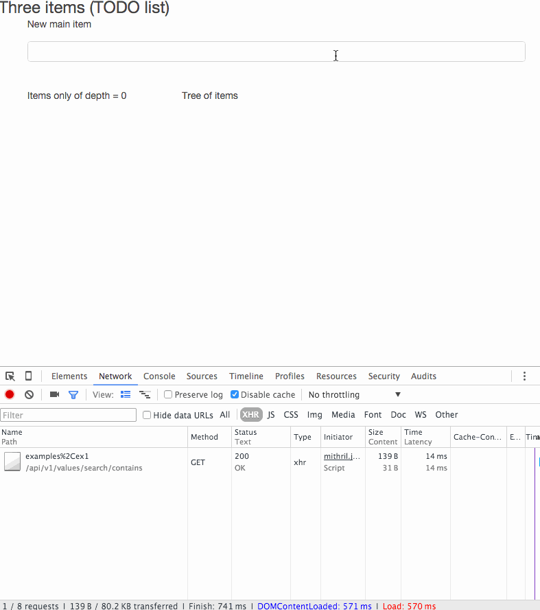
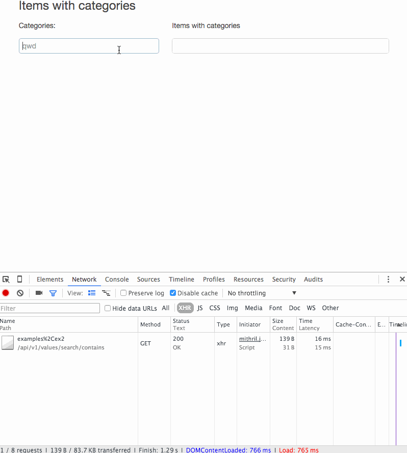
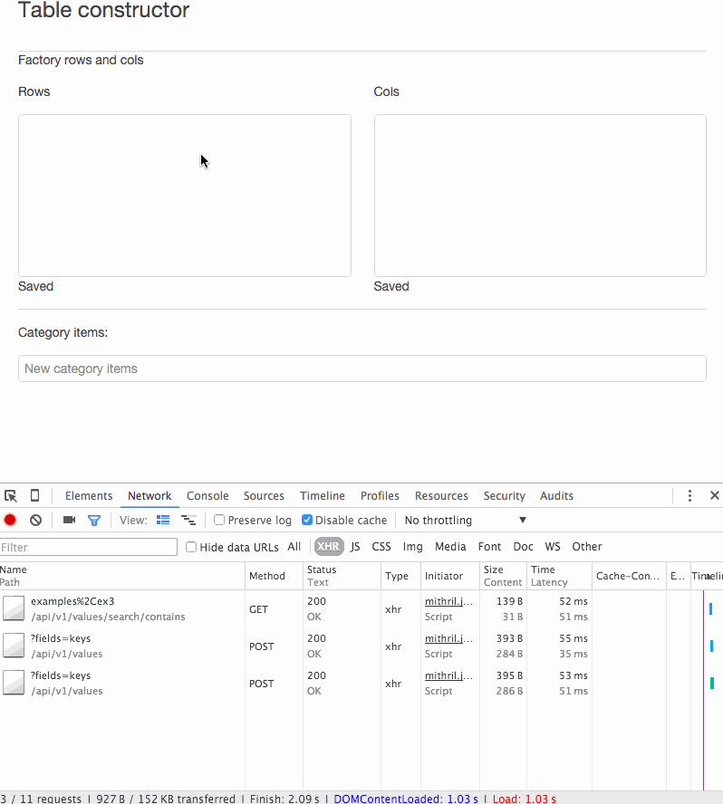
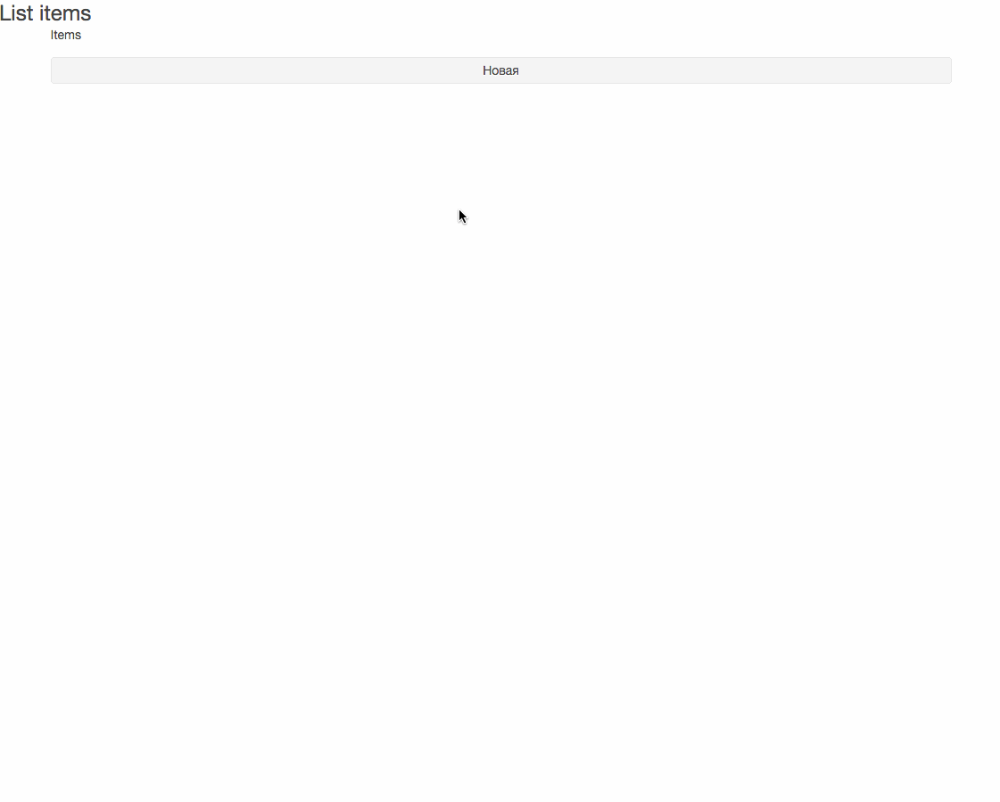

# magic keys

[](https://travis-ci.org/gebv/magickeys)

Эксперементальный проект.
Основная идея - в качестве ключа (в таблице где хранятся данные) используется массив ключей. Keys value.

Ключаеми определяете множества к которым относится элемент. Тем самым структуры данных (связи между элементами) определена указанными ключами.

Элементы можете получить как множество, ключи которого
* Полностью соответствуют указанным ключам (eq)
* Элемент присутствует в выборке если переданные ключи содержатся в ключах элемента (contains)
* Элемент присутствует в выборке если его ключи пересекаются с указанными ключами (overlap)

(Указанными ключами называют такие ключи, которые указал пользователь.)

Подмножество содержит в себе только один элемент если один из его ключей равен **uniq**. Уникальность определена по всем ключам элемента одновременно. И эта уникальность сохраняется в рамках текущих ключей.

* [api](#api)
* [database schema](#database-schema)

[Примеры](#Примеры-использования)
* [Многоуровневый TODO лист](#многоуровневый-todo-лист)
* [Список с категориями](#Список-с-категориями)
* [Конструктор таблиц](#Таблицы-с-конструктором)
* [Прочие не структурированные](#Прочие-примеры)

# Установка и запуск

``` shell
git clone https://github.com/gebv/magickeys.git

cd magickeys

make vendor_get

cp config/config.json.example config/config.json
// Обновить config/config.json в соответствии с вашими предпочтениями
// ServiceSettings.ListenAddress - инетрфейс и порт для REST API
// StorageSettings.User - пользователь БД
// StorageSettings.Database - базаданных БД

make run

//

make build
./bin/app.bin -stderrthreshold=INFO -v=2 -config=../config/config.json

// 
$ tree -L 2
.
├── Makefile
├── README.md
├── bin
│   └── app.bin
├── config
│   ├── config.json
│   ├── config.json.example
│   └── config.json.travis
├── images
│   └── magickey_todolist.gif
├── pkg
│   └── darwin_amd64
├── schema
│   └── v1.sql
├── src
│   ├── api
│   ├── main.go
│   ├── models
│   ├── store
│   ├── utils
│   └── web
├── vendor
│   ├── bin
│   ├── pkg
│   └── src
└── web
    └── examples
```

* об **-stderrthreshold** и **-v** смотри [golang/glog pkg](https://github.com/golang/glog)
* **-config** путь к настройкам приложения


## api

| URL | Описание |
| ---| --- |
| /api/v1/values/ | CRUD |
| [post] /api/v1/values/?fields=field1,fields2 | Создание элемента |
| [put] /api/v1/values/{value_id}?fields=field1,fields2 | Обновление элемента |
| [get] /api/v1/values/{value_id} | Загрузка элемента |
| [delete] /api/v1/values/{value_id} | Удаление элемента |
| /api/v1/values/search/eq/{keys} | Поиск записей по точному совпадению ключей |
| /api/v1/values/search/any/{keys} | Поиск всех записей в которых встрачется хотя бы один ключ из keys |
| /api/v1/values/search/contains/{keys} | Поиск всех записей в которых keys содержатся у ключей элемента |

* Параметр fields отражает те поля, которые будут задействованы в ходе операции

# Примеры использования

В качестве фронтенда используется [mithril](http://mithril.js.org)

* [Многоуровневый TODO лист](#многоуровневый-todo-лист)
* [Список с категориями](#Список-с-категориями)
* [Конструктор таблиц](#Таблицы-с-конструктором)

### многоуровневый TODO лист

Каждый элемент списка содержит в себе подсписок.
Каждый элемент списка может хранить булевое состояние done\notdone.

* элементы первого уровня имеют ключи [examples,simplelist]
* элементы второго уровня имеют ключи [examples,simplelist, **id**]. Где **id** является родителем и тп

[Исходник](web/examples/list.html)



```
magickeys=# SELECT * FROM values WHERE keys @> '{examples,ex1}';
-[ RECORD 1 ]----------------------------------------------------------------------------------------
value_id   | 4c90921e-d3af-11e5-8cfe-10ddb19b9d24
keys       | {ex1,examples}
value      | {"ts": 1455518556140, "label": "1"}
is_removed | f
created_at | 2016-02-15 06:42:36.19487
updated_at | 2016-02-15 06:42:36.19487
-[ RECORD 2 ]----------------------------------------------------------------------------------------
value_id   | 4cd30dd3-d3af-11e5-8cfe-10ddb19b9d24
keys       | {ex1,examples}
value      | {"ts": 1455518556607, "label": "2"}
is_removed | f
created_at | 2016-02-15 06:42:36.630575
updated_at | 2016-02-15 06:42:36.630575
-[ RECORD 3 ]----------------------------------------------------------------------------------------
value_id   | 4e4f47ad-d3af-11e5-8cfe-10ddb19b9d24
keys       | {4d106b8e-d3af-11e5-8cfe-10ddb19b9d24,ex1,examples}
value      | {"ts": 1455518559097, "label": "3.1"}
is_removed | f
created_at | 2016-02-15 06:42:39.122424
updated_at | 2016-02-15 06:42:39.122424
-[ RECORD 4 ]----------------------------------------------------------------------------------------
value_id   | 4f07d1f2-d3af-11e5-8cfe-10ddb19b9d24
keys       | {4d106b8e-d3af-11e5-8cfe-10ddb19b9d24,ex1,examples}
value      | {"ts": 1455518560301, "label": "3.2"}
is_removed | f
created_at | 2016-02-15 06:42:40.331826
updated_at | 2016-02-15 06:42:40.331826
-[ RECORD 5 ]----------------------------------------------------------------------------------------
value_id   | 501a1b4b-d3af-11e5-8cfe-10ddb19b9d24
keys       | {4d106b8e-d3af-11e5-8cfe-10ddb19b9d24,4f07d1f2-d3af-11e5-8cfe-10ddb19b9d24,ex1,examples}
value      | {"ts": 1455518562101, "done": "yes", "label": "3.2.1"}
is_removed | f
created_at | 2016-02-15 06:42:42.12939
updated_at | 2016-02-15 06:42:43.677942
-[ RECORD 6 ]----------------------------------------------------------------------------------------
value_id   | 4d106b8e-d3af-11e5-8cfe-10ddb19b9d24
keys       | {ex1,examples}
value      | {"ts": 1455518557005, "done": "yes", "label": "3"}
is_removed | f
created_at | 2016-02-15 06:42:37.032744
updated_at | 2016-02-15 06:42:44.555847

magickeys=#
```

### Список с категориями

Каждый элемент списка (карточка) может относиться к одной и более категории.

* Записи с ключами [examples,listwithcategories, **factory_categories**] определяют категорию
* Записи с ключами [examples,listwithcategories, **items**] определяют список карточек
* Категории, к которым относится карточка определена у записей с ключами [examples,listwithcategories, items, **group_categories**, **item_id**]. В качестве значения хранится идентификатор категории. **item_id** идентификатор карточки.

[Исходник](web/examples/listwithcategories.html)



```
magickeys=# SELECT * FROM values WHERE keys @> '{examples,ex2}';
-[ RECORD 1 ]-------------------------------------------------------------------------------------
value_id   | 1cb67c17-d3b0-11e5-8cfe-10ddb19b9d24
keys       | {ex2,examples,factory_categories}
value      | {"ts": 1455518905389, "label": "1"}
is_removed | f
created_at | 2016-02-15 06:48:25.409436
updated_at | 2016-02-15 06:48:25.409436
-[ RECORD 2 ]-------------------------------------------------------------------------------------
value_id   | 1d115a2d-d3b0-11e5-8cfe-10ddb19b9d24
keys       | {ex2,examples,factory_categories}
value      | {"ts": 1455518905983, "label": "2"}
is_removed | f
created_at | 2016-02-15 06:48:26.004945
updated_at | 2016-02-15 06:48:26.004945
-[ RECORD 3 ]-------------------------------------------------------------------------------------
value_id   | 1d4d3097-d3b0-11e5-8cfe-10ddb19b9d24
keys       | {ex2,examples,factory_categories}
value      | {"ts": 1455518906378, "label": "3"}
is_removed | f
created_at | 2016-02-15 06:48:26.397097
updated_at | 2016-02-15 06:48:26.397097
-[ RECORD 4 ]-------------------------------------------------------------------------------------
value_id   | 1e87beb9-d3b0-11e5-8cfe-10ddb19b9d24
keys       | {ex2,examples,items}
value      | {"ts": 1455518908436, "label": "item 1"}
is_removed | f
created_at | 2016-02-15 06:48:28.458566
updated_at | 2016-02-15 06:48:28.458566
-[ RECORD 5 ]-------------------------------------------------------------------------------------
value_id   | 1f186e02-d3b0-11e5-8cfe-10ddb19b9d24
keys       | {ex2,examples,items}
value      | {"ts": 1455518909381, "label": "item 2"}
is_removed | f
created_at | 2016-02-15 06:48:29.406772
updated_at | 2016-02-15 06:48:29.406772
-[ RECORD 6 ]-------------------------------------------------------------------------------------
value_id   | 20527057-d3b0-11e5-8cfe-10ddb19b9d24
keys       | {1f186e02-d3b0-11e5-8cfe-10ddb19b9d24,ex2,examples,group_categories,items}
value      | {"ts": 1455518911442, "selected_category_id": "1cb67c17-d3b0-11e5-8cfe-10ddb19b9d24"}
is_removed | f
created_at | 2016-02-15 06:48:31.464661
updated_at | 2016-02-15 06:48:34.088239
-[ RECORD 7 ]-------------------------------------------------------------------------------------
value_id   | 23014742-d3b0-11e5-8cfe-10ddb19b9d24
keys       | {ex2,examples,factory_categories}
value      | {"ts": 1455518915940, "label": "4"}
is_removed | f
created_at | 2016-02-15 06:48:35.965933
updated_at | 2016-02-15 06:48:35.965933
-[ RECORD 8 ]-------------------------------------------------------------------------------------
value_id   | 200c447b-d3b0-11e5-8cfe-10ddb19b9d24
keys       | {1f186e02-d3b0-11e5-8cfe-10ddb19b9d24,ex2,examples,group_categories,items}
value      | {"ts": 1455518910982, "selected_category_id": "23014742-d3b0-11e5-8cfe-10ddb19b9d24"}
is_removed | f
created_at | 2016-02-15 06:48:31.004787
updated_at | 2016-02-15 06:48:38.813121
-[ RECORD 9 ]-------------------------------------------------------------------------------------
value_id   | 24bd633c-d3b0-11e5-8cfe-10ddb19b9d24
keys       | {1e87beb9-d3b0-11e5-8cfe-10ddb19b9d24,ex2,examples,group_categories,items}
value      | {"ts": 1455518918856, "selected_category_id": "1d115a2d-d3b0-11e5-8cfe-10ddb19b9d24"}
is_removed | f
created_at | 2016-02-15 06:48:38.876448
updated_at | 2016-02-15 06:48:40.563439

magickeys=#
```

### Таблицы (с конструктором)

Динамические поля\столбцы управляющийся через конструктор.

* Записи с ключами [examples,**factory_categories**,listwithcategories] определяют группы категорий
* Записи с ключами [**id**,**categories**,examples,tablecontructor] определяют содержимое категорий. **id** идиентификатор категории к которой относится текущая запись
* Записи с ключами [**categories**,**cols**,examples,tablecontructor,**uniq**] правило образования колонок (из категорий)
* Записи с ключами [**categories**,**rows**,examples,tablecontructor,**uniq**] правило образования строк (из категорий)
* Записи с ключами [cell,col:**id**,examples,row:**id**,tablecontructor,**uniq**] хранят значение ячейки таблицы. col:**id** идентификатор категории к которой относится столбец. row:**id** идентификатор категории к которой относится строка

[Исходник](web/examples/tableconstructor.html)



```
magickeys=# SELECT * FROM values WHERE keys @> '{examples,ex3}';
-[ RECORD 1 ]----------------------------------------------------------------------------------------------------------------------------------------------------------
value_id   | 4edc0e8b-d3b0-11e5-8cfe-10ddb19b9d24
keys       | {categories,ex3,examples,rows,uniq}
value      | {"ts": 1455518989521, "options": ["67d4a000-d3b0-11e5-8cfe-10ddb19b9d24", "675b8290-d3b0-11e5-8cfe-10ddb19b9d24", "672deb42-d3b0-11e5-8cfe-10ddb19b9d24"]}
is_removed | f
created_at | 2016-02-15 06:49:49.541748
updated_at | 2016-02-15 06:50:37.376691
-[ RECORD 2 ]----------------------------------------------------------------------------------------------------------------------------------------------------------
value_id   | 4edc1142-d3b0-11e5-8cfe-10ddb19b9d24
keys       | {categories,cols,ex3,examples,uniq}
value      | {"ts": 1455518989524, "options": ["69fd6250-d3b0-11e5-8cfe-10ddb19b9d24", "69d4012b-d3b0-11e5-8cfe-10ddb19b9d24", "6997a569-d3b0-11e5-8cfe-10ddb19b9d24"]}
is_removed | f
created_at | 2016-02-15 06:49:49.541818
updated_at | 2016-02-15 06:50:38.714027
-[ RECORD 3 ]----------------------------------------------------------------------------------------------------------------------------------------------------------
value_id   | 6514dd9c-d3b0-11e5-8cfe-10ddb19b9d24
keys       | {categories,ex3,examples}
value      | {"ts": 1455519026799, "label": "cat 1"}
is_removed | f
created_at | 2016-02-15 06:50:26.823926
updated_at | 2016-02-15 06:50:26.823926
-[ RECORD 4 ]----------------------------------------------------------------------------------------------------------------------------------------------------------
value_id   | 65f7e6df-d3b0-11e5-8cfe-10ddb19b9d24
keys       | {categories,ex3,examples}
value      | {"ts": 1455519028283, "label": "cat 2"}
is_removed | f
created_at | 2016-02-15 06:50:28.31183
updated_at | 2016-02-15 06:50:28.31183
-[ RECORD 5 ]----------------------------------------------------------------------------------------------------------------------------------------------------------
value_id   | 672deb42-d3b0-11e5-8cfe-10ddb19b9d24
keys       | {65f7e6df-d3b0-11e5-8cfe-10ddb19b9d24,categories,ex3,examples}
value      | {"ts": 1455519030320, "label": "1"}
is_removed | f
created_at | 2016-02-15 06:50:30.343559
updated_at | 2016-02-15 06:50:30.343559
-[ RECORD 6 ]----------------------------------------------------------------------------------------------------------------------------------------------------------
value_id   | 675b8290-d3b0-11e5-8cfe-10ddb19b9d24
keys       | {65f7e6df-d3b0-11e5-8cfe-10ddb19b9d24,categories,ex3,examples}
value      | {"ts": 1455519030623, "label": "2"}
is_removed | f
created_at | 2016-02-15 06:50:30.642344
updated_at | 2016-02-15 06:50:30.642344
-[ RECORD 7 ]----------------------------------------------------------------------------------------------------------------------------------------------------------
value_id   | 67d4a000-d3b0-11e5-8cfe-10ddb19b9d24
keys       | {65f7e6df-d3b0-11e5-8cfe-10ddb19b9d24,categories,ex3,examples}
value      | {"ts": 1455519031411, "label": "3"}
is_removed | f
created_at | 2016-02-15 06:50:31.436083
updated_at | 2016-02-15 06:50:31.436083
-[ RECORD 8 ]----------------------------------------------------------------------------------------------------------------------------------------------------------
value_id   | 6997a569-d3b0-11e5-8cfe-10ddb19b9d24
keys       | {6514dd9c-d3b0-11e5-8cfe-10ddb19b9d24,categories,ex3,examples}
value      | {"ts": 1455519034370, "label": "a"}
is_removed | f
created_at | 2016-02-15 06:50:34.391895
updated_at | 2016-02-15 06:50:34.391895
-[ RECORD 9 ]----------------------------------------------------------------------------------------------------------------------------------------------------------
value_id   | 69d4012b-d3b0-11e5-8cfe-10ddb19b9d24
keys       | {6514dd9c-d3b0-11e5-8cfe-10ddb19b9d24,categories,ex3,examples}
value      | {"ts": 1455519034760, "label": "b"}
is_removed | f
created_at | 2016-02-15 06:50:34.78746
updated_at | 2016-02-15 06:50:34.78746
-[ RECORD 10 ]---------------------------------------------------------------------------------------------------------------------------------------------------------
value_id   | 69fd6250-d3b0-11e5-8cfe-10ddb19b9d24
keys       | {6514dd9c-d3b0-11e5-8cfe-10ddb19b9d24,categories,ex3,examples}
value      | {"ts": 1455519035034, "label": "c"}
is_removed | f
created_at | 2016-02-15 06:50:35.058645
updated_at | 2016-02-15 06:50:35.058645
-[ RECORD 11 ]---------------------------------------------------------------------------------------------------------------------------------------------------------
value_id   | 6e0f5d10-d3b0-11e5-8cfe-10ddb19b9d24
keys       | {cell,col:69d4012b-d3b0-11e5-8cfe-10ddb19b9d24,ex3,examples,row:675b8290-d3b0-11e5-8cfe-10ddb19b9d24,uniq}
value      | {"ts": 1455519041865, "value": "22"}
is_removed | f
created_at | 2016-02-15 06:50:41.887362
updated_at | 2016-02-15 06:50:44.342173
-[ RECORD 12 ]---------------------------------------------------------------------------------------------------------------------------------------------------------
value_id   | 6ccaff8c-d3b0-11e5-8cfe-10ddb19b9d24
keys       | {cell,col:69fd6250-d3b0-11e5-8cfe-10ddb19b9d24,ex3,examples,row:67d4a000-d3b0-11e5-8cfe-10ddb19b9d24,uniq}
value      | {"ts": 1455519039739, "value": "11"}
is_removed | f
created_at | 2016-02-15 06:50:39.761601
updated_at | 2016-02-15 06:50:45.783329
-[ RECORD 13 ]---------------------------------------------------------------------------------------------------------------------------------------------------------
value_id   | 6ed38c6e-d3b0-11e5-8cfe-10ddb19b9d24
keys       | {cell,col:6997a569-d3b0-11e5-8cfe-10ddb19b9d24,ex3,examples,row:672deb42-d3b0-11e5-8cfe-10ddb19b9d24,uniq}
value      | {"ts": 1455519043148, "value": "33"}
is_removed | f
created_at | 2016-02-15 06:50:43.17308
updated_at | 2016-02-15 06:50:46.513132

magickeys=#
```

### Прочие примеры

#### Список карточек

Список карточек лимитирован **size_limit**, кастомное отображение всех компонентов: списко, элемент списка (отображение), элемент списка (редактирование), кнопка создания нового элемента.
Каждый элмент списка содержит название и описание.

[Исходник](web/examples/list2.html)



# Backend

Об overlap, contains см. подробней в описании [postgresql array functions](http://www.postgresql.org/docs/9.4/static/functions-array.html) для операторов **&&** и **@>**.

РСУБД Postgres

## Database schema

``` sql

CREATE TABLE values (
    value_id uuid NOT NULL PRIMARY KEY,
    keys text[],
    value jsonb NOT NULL DEFAULT '{}',
    is_removed boolean DEFAULT false,
    created_at timestamp,
    updated_at timestamp DEFAULT now()
);

create function sort_text_array(text[]) returns text[][] as $$
    select array_agg(n) from (select n from unnest($1) as t(n) order by n) as a;
$$ language sql immutable;

CREATE INDEX values_keys_gin_idx on values USING GIN (keys);
CREATE UNIQUE INDEX values_uniq_ifcontainuniqkey_idx on values (sort_text_array(keys))
    WHERE keys @> '{uniq}';

```

## eq

```
SELECT * FROM values WHERE sort_text_array(keys) = sort_text_array('{key1, key2}')
```

## contains, ovarlap

```
SELECT * FROM values WHERE keys @> '{key1, key2}';
SELECT * FROM values WHERE keys && '{key1, key2}';
```