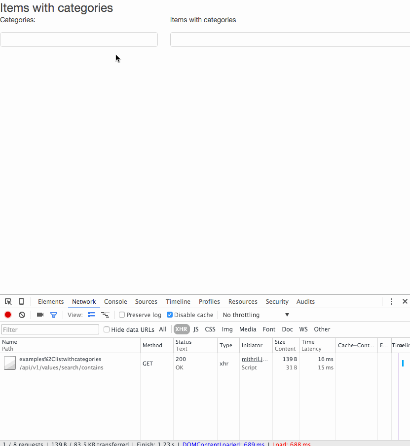

# magic keys

[](https://travis-ci.org/gebv/magickeys)

Эксперементальный проект.
Основная идея - в качестве ключа (в таблице где хранятся данные) используется массив ключей. Keys value.

Ключаеми определяете множества к которым относится элемент. Тем самым структуры данных (связи между элементами) определена указанными ключами.

Элементы можете получить как множество, ключи которого
* Полностью соответствуют указанным ключам (eq)
* Элемент присутствует в выборке если переданные ключи содержатся в ключах элемента (contains)
* Элемент присутствует в выборке если его ключи пересекаются с указанными ключами (overlap)

(Указанными ключами называют такие ключи, которые указал пользователь.)

Подмножество содержит в себе только один элемент если один из его ключей равен **uniq**. Уникальность определена по всем ключам элемента одновременно. И эта уникальность сохраняется в рамках текущих ключей.

# Установка и запуск

``` shell
git clone https://github.com/gebv/magickeys.git

cd magickeys

make vendor_get

cp config/config.json.example config/config.json
// Обновить config/config.json в соответствии с вашими предпочтениями
// ServiceSettings.ListenAddress - инетрфейс и порт для REST API
// StorageSettings.User - пользователь БД
// StorageSettings.Database - базаданных БД

make run

//

make build
./bin/app.bin -stderrthreshold=INFO -v=2 -config=../config/config.json

// 
$ tree -L 2
.
├── Makefile
├── README.md
├── bin
│   └── app.bin
├── config
│   ├── config.json
│   ├── config.json.example
│   └── config.json.travis
├── images
│   └── magickey_todolist.gif
├── pkg
│   └── darwin_amd64
├── schema
│   └── v1.sql
├── src
│   ├── api
│   ├── main.go
│   ├── models
│   ├── store
│   ├── utils
│   └── web
├── vendor
│   ├── bin
│   ├── pkg
│   └── src
└── web
    └── examples
```

* об **-stderrthreshold** и **-v** смотри [golang/glog pkg](https://github.com/golang/glog)
* **-config** путь к настройкам приложения


## api

| URL | Описание |
| ---| --- |
| /api/v1/values/ | CRUD |
| [post] /api/v1/values/?fields=field1,fields2 | Создание элемента |
| [put] /api/v1/values/{value_id}?fields=field1,fields2 | Обновление элемента |
| [get] /api/v1/values/{value_id} | Загрузка элемента |
| [delete] /api/v1/values/{value_id} | Удаление элемента |
| /api/v1/values/search/eq/{keys} | Поиск записей по точному совпадению ключей |
| /api/v1/values/search/any/{keys} | Поиск всех записей в которых встрачется хотя бы один ключ из keys |
| /api/v1/values/search/contains/{keys} | Поиск всех записей в которых keys содержатся у ключей элемента |

* Параметр fields отражает те поля, которые будут задействованы в ходе операции

# Примеры использования

В качестве фронтенда используется [mithril](http://mithril.js.org)

* многоуровневый TODO лист
* Таблицы (с конструктором)

### многоуровневый TODO лист

Каждый элемент списка содержит в себе подсписок.
Каждый элемент списка может хранить булевое состояние done\notdone.

[Исходник примера](web/examples/list.html)


```
magickeys=# SELECT * FROM values WHERE keys @> '{examples,simplelist}';
-[ RECORD 1 ]-----------------------------------------------------------------------------------------------
value_id   | f39a2780-d240-11e5-b383-10ddb19b9d24
keys       | {examples,simplelist}
value      | 1
props      | {"ts": 1455361211108}
flags      | {}
is_enabled | t
is_removed | f
created_at | 2016-02-13 11:00:11.137421
updated_at | 2016-02-13 11:00:11.137421
-[ RECORD 2 ]-----------------------------------------------------------------------------------------------
value_id   | f410ef5e-d240-11e5-b383-10ddb19b9d24
keys       | {examples,simplelist}
value      | 3
props      | {"ts": 1455361211884}
flags      | {}
is_enabled | t
is_removed | f
created_at | 2016-02-13 11:00:11.915862
updated_at | 2016-02-13 11:00:11.915862
-[ RECORD 3 ]-----------------------------------------------------------------------------------------------
value_id   | f53cf13c-d240-11e5-b383-10ddb19b9d24
keys       | {examples,f3d26df6-d240-11e5-b383-10ddb19b9d24,simplelist}
value      | 2ю1
props      | {"ts": 1455361213853}
flags      | {}
is_enabled | t
is_removed | f
created_at | 2016-02-13 11:00:13.88199
updated_at | 2016-02-13 11:00:13.88199
-[ RECORD 4 ]-----------------------------------------------------------------------------------------------
value_id   | f604a77f-d240-11e5-b383-10ddb19b9d24
keys       | {examples,f3d26df6-d240-11e5-b383-10ddb19b9d24,simplelist}
value      | 2.2
props      | {"ts": 1455361215158}
flags      | {}
is_enabled | t
is_removed | f
created_at | 2016-02-13 11:00:15.190822
updated_at | 2016-02-13 11:00:15.190822
-[ RECORD 5 ]-----------------------------------------------------------------------------------------------
value_id   | f7623aed-d240-11e5-b383-10ddb19b9d24
keys       | {examples,f410ef5e-d240-11e5-b383-10ddb19b9d24,simplelist}
value      | 3.1
props      | {"ts": 1455361217452}
flags      | {}
is_enabled | t
is_removed | f
created_at | 2016-02-13 11:00:17.481803
updated_at | 2016-02-13 11:00:17.481803
-[ RECORD 6 ]-----------------------------------------------------------------------------------------------
value_id   | f80ff014-d240-11e5-b383-10ddb19b9d24
keys       | {examples,f410ef5e-d240-11e5-b383-10ddb19b9d24,simplelist}
value      | 3.2
props      | {"ts": 1455361218588}
flags      | {}
is_enabled | t
is_removed | f
created_at | 2016-02-13 11:00:18.620213
updated_at | 2016-02-13 11:00:18.620213
-[ RECORD 7 ]-----------------------------------------------------------------------------------------------
value_id   | f9f55546-d240-11e5-b383-10ddb19b9d24
keys       | {examples,f410ef5e-d240-11e5-b383-10ddb19b9d24,f80ff014-d240-11e5-b383-10ddb19b9d24,simplelist}
value      | 3.2.1
props      | {"ts": 1455361221772, "done": "yes"}
flags      | {}
is_enabled | t
is_removed | f
created_at | 2016-02-13 11:00:21.8013
updated_at | 2016-02-13 11:00:23.378962
-[ RECORD 8 ]-----------------------------------------------------------------------------------------------
value_id   | f3d26df6-d240-11e5-b383-10ddb19b9d24
keys       | {examples,simplelist}
value      | 2
props      | {"ts": 1455361211478, "done": "yes"}
flags      | {}
is_enabled | t
is_removed | f
created_at | 2016-02-13 11:00:11.506226
updated_at | 2016-02-13 11:00:24.35061

magickeys=#
```

### Список с категориями

Каждый элемент списка может относиться к одной и более категории.

[Исходник примера](web/examples/listwithcategories.html)



```
magickeys=# SELECT * FROM values WHERE keys @> '{examples,listwithcategories}';
-[ RECORD 1 ]-----------------------------------------------------------------------------------------
value_id   | 04e03592-d25d-11e5-87e7-10ddb19b9d24
keys       | {examples,factory_categories,listwithcategories}
value      | c1
props      | {"ts": 1455373266008}
flags      | {}
is_enabled | t
is_removed | f
created_at | 2016-02-13 14:21:06.026229
updated_at | 2016-02-13 14:21:06.026229
-[ RECORD 2 ]-----------------------------------------------------------------------------------------
value_id   | 0559f3ae-d25d-11e5-87e7-10ddb19b9d24
keys       | {examples,factory_categories,listwithcategories}
value      | c2
props      | {"ts": 1455373266805}
flags      | {}
is_enabled | t
is_removed | f
created_at | 2016-02-13 14:21:06.824082
updated_at | 2016-02-13 14:21:06.824082
-[ RECORD 3 ]-----------------------------------------------------------------------------------------
value_id   | 05ebead2-d25d-11e5-87e7-10ddb19b9d24
keys       | {examples,factory_categories,listwithcategories}
value      | c3
props      | {"ts": 1455373267762}
flags      | {}
is_enabled | t
is_removed | f
created_at | 2016-02-13 14:21:07.78068
updated_at | 2016-02-13 14:21:07.78068
-[ RECORD 4 ]-----------------------------------------------------------------------------------------
value_id   | 06c31f02-d25d-11e5-87e7-10ddb19b9d24
keys       | {examples,items,listwithcategories}
value      | item 1
props      | {"ts": 1455373269168}
flags      | {}
is_enabled | t
is_removed | f
created_at | 2016-02-13 14:21:09.19104
updated_at | 2016-02-13 14:21:09.19104
-[ RECORD 5 ]-----------------------------------------------------------------------------------------
value_id   | 0788435f-d25d-11e5-87e7-10ddb19b9d24
keys       | {examples,items,listwithcategories}
value      | item 2
props      | {"ts": 1455373270462}
flags      | {}
is_enabled | t
is_removed | f
created_at | 2016-02-13 14:21:10.48303
updated_at | 2016-02-13 14:21:10.483031
-[ RECORD 6 ]-----------------------------------------------------------------------------------------
value_id   | 0897a703-d25d-11e5-87e7-10ddb19b9d24
keys       | {examples,items,listwithcategories}
value      | item 3
props      | {"ts": 1455373272231}
flags      | {}
is_enabled | t
is_removed | f
created_at | 2016-02-13 14:21:12.261607
updated_at | 2016-02-13 14:21:12.261607
-[ RECORD 7 ]-----------------------------------------------------------------------------------------
value_id   | 0946acad-d25d-11e5-87e7-10ddb19b9d24
keys       | {0897a703-d25d-11e5-87e7-10ddb19b9d24,examples,group_categories,items,listwithcategories}
value      | 0559f3ae-d25d-11e5-87e7-10ddb19b9d24
props      | {"ts": 1455373273379}
flags      | {}
is_enabled | t
is_removed | f
created_at | 2016-02-13 14:21:13.408632
updated_at | 2016-02-13 14:21:15.720622
-[ RECORD 8 ]-----------------------------------------------------------------------------------------
value_id   | 09cf58eb-d25d-11e5-87e7-10ddb19b9d24
keys       | {0897a703-d25d-11e5-87e7-10ddb19b9d24,examples,group_categories,items,listwithcategories}
value      | 04e03592-d25d-11e5-87e7-10ddb19b9d24
props      | {"ts": 1455373274278}
flags      | {}
is_enabled | t
is_removed | f
created_at | 2016-02-13 14:21:14.304331
updated_at | 2016-02-13 14:21:17.345232
-[ RECORD 9 ]-----------------------------------------------------------------------------------------
value_id   | 0d932d3d-d25d-11e5-87e7-10ddb19b9d24
keys       | {examples,factory_categories,listwithcategories}
value      | c4
props      | {"ts": 1455373280599}
flags      | {}
is_enabled | t
is_removed | f
created_at | 2016-02-13 14:21:20.620883
updated_at | 2016-02-13 14:21:20.620883
-[ RECORD 10 ]----------------------------------------------------------------------------------------
value_id   | 0c7b9ef0-d25d-11e5-87e7-10ddb19b9d24
keys       | {0788435f-d25d-11e5-87e7-10ddb19b9d24,examples,group_categories,items,listwithcategories}
value      | 0d932d3d-d25d-11e5-87e7-10ddb19b9d24
props      | {"ts": 1455373278766}
flags      | {}
is_enabled | t
is_removed | f
created_at | 2016-02-13 14:21:18.788786
updated_at | 2016-02-13 14:21:22.463049

magickeys=#
```

### Таблицы (с конструктором)

Динамические поля\столбцы управляющийся через конструктор.

...

# Backend

Об overlap, contains см. подробней в описании [postgresql array functions](http://www.postgresql.org/docs/9.4/static/functions-array.html) для операторов **&&** и **@>**.

РСУБД Postgres

## Database schema

``` sql
create function sort_text_array(text[]) returns text[][] as $$
    select array_agg(n) from (select n from unnest($1) as t(n) order by n) as a;
$$ language sql immutable;

CREATE TABLE values (
    value_id uuid NOT NULL PRIMARY KEY,
    keys text[],
    value text,
    props jsonb NOT NULL DEFAULT '{}', -- Вспомогательное поле для хранения расширенных значений
    flags text[], -- Вспомогательное поле для хранение расширенных значений

    is_enabled boolean DEFAULT true,
    is_removed boolean DEFAULT false,
    created_at timestamp,
    updated_at timestamp DEFAULT now()
);
CREATE INDEX values_keys_idx on values USING GIN (keys);
CREATE UNIQUE INDEX values_keys_ifuniq_idx on values (sort_text_array(keys))
    WHERE keys @> '{uniq}';

```

## eq

```
SELECT * FROM values WHERE sort_text_array(keys) = sort_text_array('{key1, key2}')
```

## contains, ovarlap

```
SELECT * FROM values WHERE keys @> '{key1, key2}';
SELECT * FROM values WHERE keys && '{key1, key2}';
```