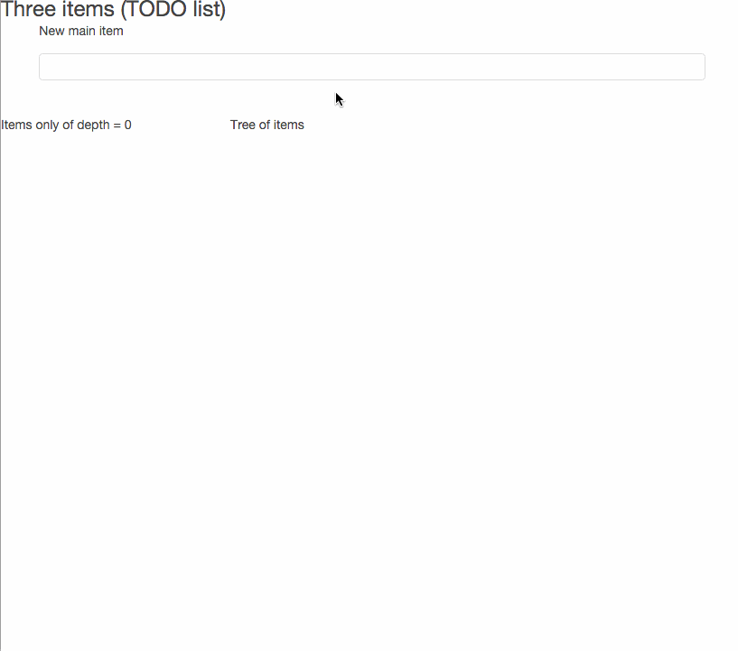

# magic keys

[](https://travis-ci.org/gebv/magickeys)

Эксперементальный проект.
Основная идея - в качестве ключа (в таблице где хранятся данные) используется массив ключей. Keys value.

Ключаеми определяете множества к которым относится элемент. Тем самым структуры данных (связи между элементами) определена указанными ключами.

Элементы можете получить как множество, ключи которого
* Полностью соответствуют указанным ключам (eq)
* Элемент присутствует в выборке если переданные ключи содержатся в ключах элемента (contains)
* Элемент присутствует в выборке если его ключи пересекаются с указанными ключами (overlap)

(Указанными ключами называют такие ключи, которые указал пользователь.)

Подмножество содержит в себе только один элемент если один из его ключей равен **uniq**. Уникальность определена по всем ключам элемента одновременно. И эта уникальность сохраняется в рамках текущих ключей.

# Установка и запуск

``` shell
git clone https://github.com/gebv/magickeys.git

cd magickeys

make vendor_get

cp config/config.json.example config/config.json
// Обновить config/config.json в соответствии с вашими предпочтениями
// ServiceSettings.ListenAddress - инетрфейс и порт для REST API
// StorageSettings.User - пользователь БД
// StorageSettings.Database - базаданных БД

make run

//

make build
./bin/app.bin -stderrthreshold=INFO -v=2 -config=../config/config.json

// 
$ tree -L 2
.
├── Makefile
├── README.md
├── bin
│   └── app.bin
├── config
│   ├── config.json
│   ├── config.json.example
│   └── config.json.travis
├── images
│   └── magickey_todolist.gif
├── pkg
│   └── darwin_amd64
├── schema
│   └── v1.sql
├── src
│   ├── api
│   ├── main.go
│   ├── models
│   ├── store
│   ├── utils
│   └── web
├── vendor
│   ├── bin
│   ├── pkg
│   └── src
└── web
    └── examples
```

* об **-stderrthreshold** и **-v** смотри [golang/glog pkg](https://github.com/golang/glog)
* **-config** путь к настройкам приложения


## api

| URL | Описание |
| ---| --- |
| /api/v1/values/ | CRUD |
| [post] /api/v1/values/?fields=field1,fields2 | Создание элемента |
| [put] /api/v1/values/{value_id}?fields=field1,fields2 | Обновление элемента |
| [get] /api/v1/values/{value_id} | Загрузка элемента |
| [delete] /api/v1/values/{value_id} | Удаление элемента |
| /api/v1/values/search/eq/{keys} | Поиск записей по точному совпадению ключей |
| /api/v1/values/search/any/{keys} | Поиск всех записей в которых встрачется хотя бы один ключ из keys |
| /api/v1/values/search/contains/{keys} | Поиск всех записей в которых keys содержатся у ключей элемента |

* Параметр fields отражает те поля, которые будут задействованы в ходе операции

# Примеры использования

В качестве фронтенда используется [mithril](http://mithril.js.org)

* многоуровневый TODO лист
* Таблицы (с конструктором)

### многоуровневый TODO лист

todo list __web/examples/list.html__ 



```
magickeys=# SELECT keys, value, props FROM values;
-[ RECORD 1 ]------------------------------------------------------------------------------------------
keys  | {examples,simplelist}
value | 1
props | {"ts": "ts1455291704475", "done": "no"}
-[ RECORD 2 ]------------------------------------------------------------------------------------------
keys  | {examples,simplelist}
value | 2
props | {"ts": "ts1455291704949", "done": "no"}
-[ RECORD 3 ]------------------------------------------------------------------------------------------
keys  | {examples,simplelist}
value | 3
props | {"ts": "ts1455291705508", "done": "no"}
-[ RECORD 4 ]------------------------------------------------------------------------------------------
keys  | {examples,simplelist,1f0803ee-d19f-11e5-b356-10ddb19b9d24}
value | 3.1
props | {"ts": "ts1455291708861", "done": "no"}
-[ RECORD 5 ]------------------------------------------------------------------------------------------
keys  | {examples,simplelist,1f0803ee-d19f-11e5-b356-10ddb19b9d24,22b85341-d19f-11e5-b356-10ddb19b9d24}
value | 3.3.1
props | {"ts": "ts1455291714655", "done": "no"}
-[ RECORD 6 ]------------------------------------------------------------------------------------------
keys  | {examples,simplelist,1e6bf1b0-d19f-11e5-b356-10ddb19b9d24}
value | 1.1
props | {"ts": "ts1455291717220", "done": "no"}
-[ RECORD 7 ]------------------------------------------------------------------------------------------
keys  | {examples,simplelist,1f0803ee-d19f-11e5-b356-10ddb19b9d24}
value | 3.2
props | {"ts": "ts1455291709930", "done": "yes"}
-[ RECORD 8 ]------------------------------------------------------------------------------------------
keys  | {examples,simplelist,1f0803ee-d19f-11e5-b356-10ddb19b9d24}
value | 3.3
props | {"ts": "ts1455291711696", "done": "yes"}

magickeys=#
```

### Таблицы (с конструктором)

Динамические поля\столбцы управляющийся через конструктор.

...

# Backend

Об overlap, contains см. подробней в описании [postgresql array functions](http://www.postgresql.org/docs/9.4/static/functions-array.html) для операторов **&&** и **@>**.

РСУБД Postgres

## Database schema

``` sql
create function sort_text_array(text[]) returns text[][] as $$
    select array_agg(n) from (select n from unnest($1) as t(n) order by n) as a;
$$ language sql immutable;

CREATE TABLE values (
    value_id uuid NOT NULL PRIMARY KEY,
    keys text[],
    value text,
    props jsonb NOT NULL DEFAULT '{}', -- Вспомогательное поле для хранения расширенных значений
    flags text[], -- Вспомогательное поле для хранение расширенных значений

    is_enabled boolean DEFAULT true,
    is_removed boolean DEFAULT false,
    created_at timestamp,
    updated_at timestamp DEFAULT now()
);
CREATE INDEX values_keys_idx on values USING GIN (keys);
CREATE UNIQUE INDEX values_keys_ifuniq_idx on values (sort_text_array(keys))
    WHERE keys @> '{uniq}';

```

## eq

```
SELECT * FROM values WHERE sort_text_array(keys) = sort_text_array('{key1, key2}')
```

## contains, ovarlap

```
SELECT * FROM values WHERE keys @> '{key1, key2}';
SELECT * FROM values WHERE keys && '{key1, key2}';
```